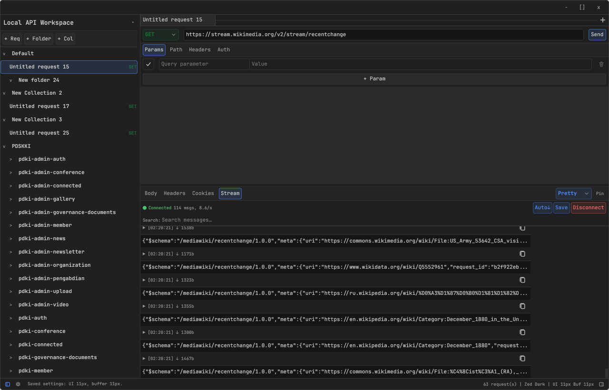

# apie

**A native Rust desktop API client** — built with [GPUI](https://github.com/zed-industries/zed/tree/main/crates/gpui) for compact local request building, real HTTP execution, response inspection, OpenAPI import/export, and live streaming (WebSocket/SSE).



---

## Features

- **Send real HTTP requests** — GET, POST, PUT, PATCH, DELETE, OPTIONS over HTTP and HTTPS with automatic redirect handling (up to 10 hops).
- **Per-phase timing** — DNS lookup, TCP connect, TLS handshake, time-to-first-byte, and transfer time measured separately and visualized in a popover. No reqwest dependency — uses a custom hyper + tokio-rustls stack.
- **Editor-like inputs** — URL field, code body editor, and response viewer with syntax coloring, line numbers, word-by-word selection, and `Ctrl+A` select-all.
- **Request panels** — Flat, full-width Params, Path, Headers, Auth, and Body sections with row-level toggles. Auth types: None, Basic, Bearer Token, API Key (header/query/cookie).
- **Environment variables** — `{{base_url}}`/`{{token}}` template resolution across URL, headers, body, and auth fields. Multiple environments per workspace.
- **Collections & folders** — Hierarchical request trees with drag-to-reorder, rename/delete dialogs, and right-click context menus. Multiple collections per workspace.
- **Tabbed request editing** — Open requests into tabs; close a tab without touching the collection. Keyboard shortcuts: `Ctrl+T` new tab, `Ctrl+W` close tab.
- **Response inspection** — Pretty/Raw body views, headers (with wrapping values and per-value copy), cookies, status/time/size metadata. Handles multi-MB response bodies with soft thresholds (5 MiB pretty-print guard, 10 MiB warning banner).
- **Live streaming** — WebSocket (`ws://`/`wss://`) and SSE streaming inspector with virtualized message list, search, binary frame handling, and session auto-scroll.
- **OpenAPI 3.x import & export** — Import OpenAPI specs (JSON/YAML) from file or URL, with optional Live Watch for auto-syncing. Export workspaces to OpenAPI 3.0.3 JSON.
- **Find in response** — `Ctrl+F` / `F3` / `Shift+F3` to search response body text.
- **Multi-workspace** — Create, switch, and manage separate workspaces (each with its own collections and environments).
- **Theme support** — System-follow, Zed Dark, and Zed Light themes. Adjustable UI and buffer font sizes.
- **Compact desktop UI** — 24px unified button/input height, 28px tab bar, 4px base spacing. Visually inspired by Zed without copying source code.
- **Client-side decorations** — Custom titlebar, resize handles, and window background.

---

## Architecture

The app follows a layered architecture that separates reusable domain logic from desktop-specific view state:

```text
src/
  lib.rs                 Public facade: domain + HTTP + import/export
  main.rs                GPUI startup, asset source, window creation
  settings.rs            Persisted settings (theme, font sizes, active workspace)
  domain/
    models.rs            Serializable models: Request, Response, Auth, Environment, Workspace
    workspace.rs         Workspace operations: create, edit, send
    persistence.rs       JSON load/save with format versioning and migration
    preview.rs           Synthetic response helper for offline/demo use
    error.rs             Core error/result types
  http/
    mod.rs               Custom HTTP client (hyper + tokio-rustls) with per-phase timing + SSE
    ws.rs                WebSocket client (tokio-tungstenite)
  app/
    mod.rs               ApiClientApp struct, constructor, key bindings
    types.rs             GPUI-local types (numeric IDs, SharedString wrappers)
    state.rs             Input management, settings/workspace persistence helpers
    resolve.rs           Template resolution, auth application, body formatting
    actions/
      crud.rs            Collection CRUD, tab management, param/header/body controls
      send.rs            Request sending, cancel, dialog actions
      settings.rs        Settings dialog, method menu, clipboard
      dialogs.rs         Rename/delete dialogs, context menus
    render.rs            All render_* methods and impl Render for ApiClientApp
    tests.rs             GPUI interaction and smoke tests
  ui/
    code_input.rs        Multiline editor with line numbers, syntax coloring, line cache
    input.rs             Single-line editor-like text input
    scrollbar.rs         Custom vertical/horizontal scrollbar primitives
    controls.rs          Buttons, selects, menus
    layout.rs            Shell, toolbar, panel, section primitives
    tabs.rs              Tab rendering and close affordances
    theme.rs             Theme tokens (Zed Dark/Light)
    typography.rs        UI and buffer font helpers
    spacing.rs           Compact spacing scale
    icons.rs             SVG icon loading (embedded at compile time)
  import/
    openapi.rs           OpenAPI 3.x parser -> domain::Collection
  export/
    openapi.rs           domain::Workspace -> OpenAPI 3.0.3 JSON
```

### Key Design Decisions

- **Domain/app split**: Domain layer uses string IDs for serialization; app layer uses numeric IDs for GPUI hit-testing and state management.
- **No reqwest**: A custom hyper + tokio-rustls HTTP stack provides instrumented per-phase timing.
- **Embedded assets**: SVG icons are compiled into the binary via `include_bytes!` — no runtime filesystem dependency.
- **No cloud**: Preferences fast local workflows. No web app, no database, no cloud sync.

---

## Getting Started

### Prerequisites

- Rust 2024 edition (stable toolchain, minimum supported version is the latest stable)
- A GPU-compatible display (GPUI requires Metal/Vulkan/DirectX)

### Build & Run

```bash
cargo run
```

Opens a 1280×820 window with a default workspace and sample environment.

### Build Only

```bash
cargo build
```

Binary at `target/debug/gpui-hello-world` (the crate name predates the current project name).

### Test

```bash
cargo test
```

Runs domain model tests, persistence round-trip tests, HTTP integration tests (with local TCP listeners), SSE parsing tests, environment resolution tests, and GPUI interaction tests.

### Quick Type Check

```bash
cargo check
```

---

## Usage

1. **Enter a URL** in the top input field (e.g., `https://api.example.com/users`).
2. **Select HTTP method** from the dropdown beside the URL (GET, POST, PUT, PATCH, DELETE, OPTIONS).
3. **Configure request** using the flat panels below the URL:
   - **Params** — query string parameters (auto-appended to URL)
   - **Path** — path parameters from `{param}` in the URL
   - **Headers** — custom HTTP headers with per-row enable/disable
   - **Auth** — Basic, Bearer, or API Key authentication
   - **Body** — raw JSON/text body (shown only for POST/PUT/PATCH)
4. **Use environment variables** with `{{variable_name}}` syntax.
5. **Send** — click Send or press Enter (when URL field is focused).
6. **Inspect response** — Body (Pretty/Raw), Headers, Cookies. Click the timing popover for per-phase breakdown.
7. **Save to workspace** — requests are auto-persisted. Create folders, reorder with drag, or export to OpenAPI.

---

## Contributing

We welcome contributions. Before opening a PR:

1. Read `ARCHITECTURE.md` and relevant docs in `docs/` for design conventions.
2. Run `cargo check` and `cargo test` — all tests must pass.
3. Keep changes minimal and focused. Preserve the domain/app boundary.
4. Update `AGENTS.md` and relevant `docs/` files if you change architecture or behavior.
5. Use clear commit messages (e.g., `feat: add <feature>` or `fix: correct <behavior>`).

See [`docs/index.md`](docs/index.md) for the full documentation catalog.

---

## Open-Source Plan

This project is being prepared for public open-source release. Here is the plan:

### Phase 1: Foundation (Pre-Release)

| Step | Description |
|------|-------------|
| 1.1 | **Add license** — Apache 2.0 (includes patent grant, widely used in Rust ecosystem). `LICENSE` file already included in the repository. |
| 1.2 | **Audit third-party dependencies** — Verify all dependencies in `Cargo.toml` use compatible licenses (MIT, Apache 2.0, BSD, or similar). The current stack (GPUI, hyper, tokio, serde, openapiv3) is permissively licensed. |
| 1.3 | **Add CI configuration** — Set up GitHub Actions (or equivalent) for `cargo check`, `cargo test`, and `cargo fmt --check` on every PR and push to main. |
| 1.4 | **Add a release workflow** — Automate binary builds for Linux (and macOS/Windows as GPUI support matures) using `cargo build --release` and upload as GitHub release artifacts. |
| 1.5 | **Clean up the codebase** — Resolve any `#[allow(dead_code)]` annotations, remove stale commented-out code, and ensure all public API surface has doc comments. |

### Phase 2: Documentation & Onboarding

| Step | Description |
|------|-------------|
| 2.1 | **Add a CONTRIBUTING.md** — Contributor guide covering how to set up the dev environment, coding conventions, PR workflow, and testing expectations. |
| 2.2 | **Add a CODE_OF_CONDUCT.md** — Adopt the [Contributor Covenant](https://www.contributor-covenant.org/) code of conduct. |
| 2.3 | **Add issue/PR templates** — GitHub templates for bug reports, feature requests, and pull requests. |
| 2.4 | **Add a CHANGELOG.md** — Keep a human-readable changelog following [Keep a Changelog](https://keepachangelog.com/) conventions. |
| 2.5 | **Review and update all docs** — Ensure `ARCHITECTURE.md`, `docs/DESIGN.md`, `docs/FRONTEND.md`, and others are up-to-date and accessible to new contributors. |

### Phase 3: Polish & Hardening

| Step | Description |
|------|-------------|
| 3.1 | **Improve error messages** — Audit all user-facing error messages for clarity and consistency. |
| 3.2 | **Add logging** — Introduce structured logging (e.g., `tracing`) for debugging without stderr pollution. |
| 3.3 | **Edge-case testing** — Add tests for: empty workspaces, corrupted JSON files, invalid URLs, very large responses, concurrent request cancellation, and rapid tab switching. |
| 3.4 | **Security review** — Ensure credentials in environment variables are not accidentally persisted in plaintext to workspace files unnecessarily. Review `pin_response` behavior. |
| 3.5 | **Cross-platform sanity** — Verify the app builds and runs on macOS and Windows (as GPUI supports them). |

### Phase 4: Launch

| Step | Description |
|------|-------------|
| 4.1 | **Create GitHub repository** — Set up the public repo, push code, configure branch protection on `main`. |
| 4.2 | **Add README badges** — Build status, license, Rust version, test coverage. |
| 4.3 | **Write a launch announcement** — Brief blog post or discussion thread explaining the project's motivation and design philosophy. |
| 4.4 | **Tag v0.1.0 release** — First public release with pre-built binaries. |

---

## License

Licensed under the Apache License, Version 2.0 (the "License"); you may not use this project except in compliance with the License. You may obtain a copy of the License at <http://www.apache.org/licenses/LICENSE-2.0>.

Unless required by applicable law or agreed to in writing, software distributed under the License is distributed on an "AS IS" BASIS, WITHOUT WARRANTIES OR CONDITIONS OF ANY KIND, either express or implied. See the LICENSE file for details.

---

## Acknowledgments

- Built with [GPUI](https://github.com/zed-industries/zed) — the native UI framework from Zed Industries.
- Visual design references [Zed](https://zed.dev/) without copying GPL-licensed source code.
- Uses the [openapiv3](https://crates.io/crates/openapiv3) crate for OpenAPI parsing.
- Uses [hyper](https://hyper.rs/), [tokio](https://tokio.rs/), [rustls](https://github.com/rustls/rustls), and [tokio-tungstenite](https://github.com/snapview/tokio-tungstenite) for networking.
